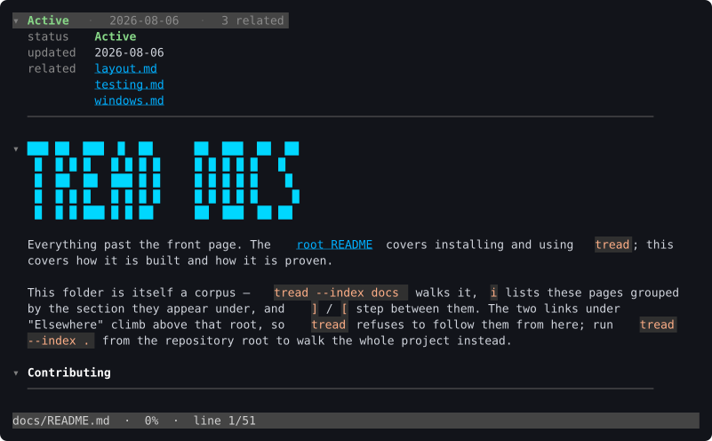
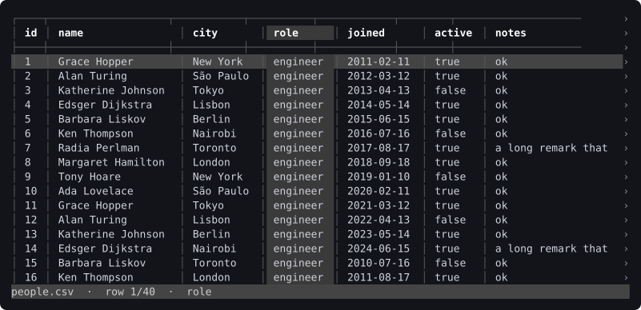
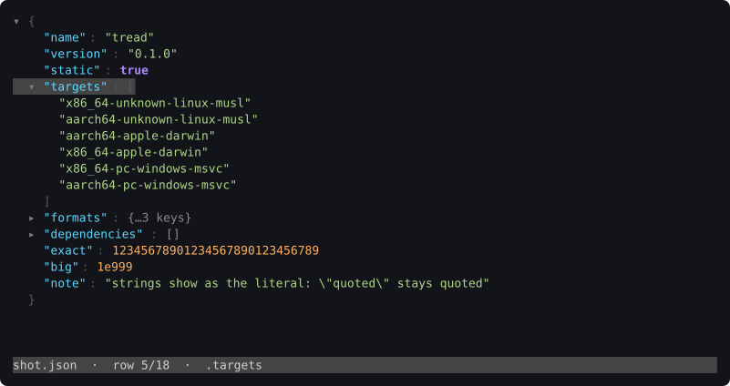

# tread

`less`, but it understands file types.

A terminal reader for markdown, CSV, JSON, JSON Lines and source code.
Collapsible headings, banner H1s, real box-drawn tables, colored links, and
navigation across a corpus of linked documents — in code, the same folds over
declarations and the same `Enter` over an import — and for data, files far too
big to load:
a multi-GB CSV or JSON opens in milliseconds, because nothing reads the whole
file. One static binary, no runtime, no configuration, **no dependencies at
all** — not even `libc`. Every format is compiled in; nothing is ever loaded at
runtime.



## Install

```sh
curl -fsSL https://raw.githubusercontent.com/viict/tread/master/install.sh | sh
```

That puts a verified binary in `~/.local/bin/tread`. It picks the build for
your platform, checks it against the release's `SHA256SUMS`, and refuses to
install anything that does not match.

```sh
# somewhere else on your PATH
INSTALL_PATH=/usr/local/bin curl -fsSL https://raw.githubusercontent.com/viict/tread/master/install.sh | sh

# a particular release rather than the newest
VERSION=v0.1.0 curl -fsSL https://raw.githubusercontent.com/viict/tread/master/install.sh | sh
```

On Windows, in PowerShell:

```powershell
irm https://raw.githubusercontent.com/viict/tread/master/install.ps1 | iex
```

That puts `tread.exe` in `%LOCALAPPDATA%\Programs\tread` and checks the same
`SHA256SUMS`, refusing to install on a mismatch. If that directory is not on
your `PATH` it prints the one command that adds it, and changes nothing itself —
same as `install.sh`. It picks the x64 or ARM64 build for the machine, and works
in both Windows PowerShell 5.1 (what ships with Windows) and PowerShell 7.

```powershell
# somewhere else
$env:INSTALL_PATH = 'C:\tools'; irm https://raw.githubusercontent.com/viict/tread/master/install.ps1 | iex

# a particular release rather than the newest
$env:VERSION = 'v0.1.0'; irm https://raw.githubusercontent.com/viict/tread/master/install.ps1 | iex
```

From a package manager, if you already have one:

```sh
cargo install tread            # crates.io; builds from source
npx @viict/tread README.md     # npm; fetches the build for your machine once
```

The unscoped `tread` on npm is an unrelated package, so the scope is not
optional. `npm install -g @viict/tread` puts the binary on your `PATH` under its
own name. Set `TREAD_BINARY` to a `tread` you already have and the npm launcher
downloads nothing at all — which is what one global install shared by several
accounts, or a CI runner with no route out, wants.

Prefer not to pipe the internet into a shell? Read
[`install.sh`](install.sh) or [`install.ps1`](install.ps1) first, or take a
`.tar.gz` — a `.zip` on Windows — from the
[releases page](https://github.com/viict/tread/releases). It holds one static
binary and nothing else.

```
$ tread README.md
$ tread data.csv
$ tread big.json
$ tread --index ~/notes
```

## What it does

- **Collapsible sections.** Every heading carries a `▾`/`▸` marker in the
  gutter. `za` folds the section under the cursor, `zM` folds everything, `zR`
  opens it back up.
- **Real tables.** Column widths are computed from content, `:---`/`:---:`/
  `---:` alignment is honored, and a table wider than the terminal scrolls
  horizontally with `h`/`l` instead of being mangled.
- **Frontmatter is content, not noise.** A leading `---` block folds to one
  summary line — `Active · viict · 2026-07-07 · 5 related` — so the status is
  always in view without a long `related:` list pushing the document off the
  screen. `za` opens it into an aligned key/value block where `status` is
  coloured by whether the doc is live, in flight or historical, every `related:`
  path is a link you reach with `n` and follow with `Enter`, and `y` copies the
  field under the cursor.
- **Data files that are too big to load.** A CSV or JSON of any size opens in
  milliseconds and quits instantly, because nothing reads the whole file:
  containers are indexed by byte range, lazily and at every level, and a value
  is parsed only when it is on screen. A 25 MB object wrapping one enormous
  array opens as fast as a small one.
- **JSON that says what the file says.** Numbers keep their source text, so
  `1e999` and a 40-digit integer are not quietly rounded through `f64`.
  Duplicate keys are kept in order. Strings are shown as the literal, escapes
  and all, so what is on screen re-parses to the value on screen.
- **A document tree.** Relative links resolve against the current file.
  `Enter` follows one, `Backspace` goes back, `i` opens the corpus index
  grouped by the section each link appeared under.
- **Search, outline, yank.** `/` searches, `o` shows the outline, `v` starts a
  visual line selection, `y` puts it on the system clipboard over OSC 52 (with
  a file fallback so a terminal that refuses the escape never loses the copy).
- **Correct widths.** Wrapping uses display columns, so CJK is width 2,
  combining marks are width 0, and emoji do not desynchronise the layout.
- **The mouse is never captured.** No `?1000h`, no `?1002h`, no `?1006h`. Your
  terminal's own click-drag selection keeps working, always. This is a product
  requirement, not an oversight.

## Currently supported file-types

| Format | Extensions | Notes |
| --- | --- | --- |
| Markdown | `.md`, `.markdown` | GitHub flavour, tables, YAML frontmatter |
| CSV | `.csv`, `.tsv` | any size; sniffed delimiter, `sep=` directive |
| JSON | `.json` | any size; foldable tree, source-faithful values |
| JSON Lines | `.jsonl`, `.ndjson` | any size; one record per line, lenses |
| Code | `.rs`, `.ts` `.tsx` `.js` `.jsx` `.mjs` `.cjs`, `.py` `.pyi`, `.java` | folds over declarations, `Enter` follows an import |
| Plain text | `.txt`, `.text`, and any extension naming no parser | the file's lines, verbatim |

Anything unnamed — a pipe — is sniffed. `--format` forces the choice among
`md`, `csv`, `json`, `jsonl` and `text`; code is chosen by extension, since a
file that does not lex cleanly falls back to plain source on its own.

## Build from source

A Rust toolchain (1.75+) is all you need — no C compiler, no linker, no system
libraries.

```sh
cargo build --release
./target/release/tread --help
```

For the shipping artifact, one file that runs on any x86-64 Linux from a
scratch container upward:

```sh
rustup target add x86_64-unknown-linux-musl
cargo musl                      # alias for --release --target …-musl
```

```
$ ldd target/x86_64-unknown-linux-musl/release/tread
        statically linked                             # 649 KiB
```

| Platform | Target | Linkage |
| --- | --- | --- |
| Linux | `x86_64-unknown-linux-musl`, `aarch64-unknown-linux-musl` | fully static |
| Linux | `x86_64-unknown-linux-gnu` | dynamic (glibc) |
| macOS | `aarch64-apple-darwin`, `x86_64-apple-darwin` | dynamic, `libSystem` only |
| Windows 10 1703+ | `x86_64-pc-windows-msvc`, `aarch64-pc-windows-msvc`, `x86_64-pc-windows-gnu` | dynamic, `kernel32` only |

Build for a platform on that platform. The musl binary is a Linux ELF and will
not run on macOS; macOS cannot be statically linked at all, because Apple does
not ship a static libc. Any unix that is neither Linux nor Darwin is refused at
compile time with a message naming the work, rather than served a `termios`
layout that is probably wrong.

Every target in that table is built *and* tested on its own architecture by CI
on each release, so the macOS and Windows backends run for real rather than
merely type-checking. What no CI run covers is interactive behaviour — that a
console host restores its mode on exit, that drag-select still works while the
pager is up — because none of it happens without a terminal attached.
[`docs/windows.md`](docs/windows.md) records what the console backend does and what is
still only inferred.

## Usage

```
tread [OPTIONS] [FILE]

  --index <PATH>   Treat PATH as the corpus index. PATH may be a markdown file
                   or a directory containing README.md. Relative links in the
                   corpus resolve against it.
  --no-alt         Render into the scrollback instead of the alternate screen,
                   so the output stays visible after quitting.
  --plain          Disable color. Implied by NO_COLOR or a non-terminal stdout.
  --no-browser     Never open an external link. `Enter` on an `http`, `https`
                   or `mailto` link normally hands the URL to the system opener
                   (one process, never a shell); this shows the URL and refuses
                   instead. Every other scheme is always refused, by name.
  --width <N>      Force the wrap width instead of detecting the terminal size.
  --format <FMT>   Force the format: `md`, `csv`, `json`, `jsonl` (`ndjson`)
                   or `text`. By default the extension decides — a name it does
                   not know is plain text — and unnamed input (a pipe) is
                   sniffed.
  --delim <D>      CSV field delimiter: one character, or `tab`, `comma`,
                   `semicolon`, `pipe`. Sniffed among `,` TAB `;` `|` otherwise.
  --lens <NAME>    Read a record file through a semantic view: `agent` for
                   Claude Code session logs. `--lens list` prints them all.
                   Without it, records render as the generic tree.
  --toc            Print the heading outline (CSV: the column names; JSON: the
                   root's members) and exit.
  --to-jsonl       Write a JSON document's top-level array to stdout as one
                   element per line, and exit. Streams; anything but an array
                   is refused with the reason.
  -h, --help       Show help.
  -V, --version    Show the version.
```

With no `FILE`, `tread` reads piped stdin, or opens the corpus index when stdin
is a terminal. `-` forces reading stdin. Piping works because keys are read
from `/dev/tty` when stdin is busy:

```sh
cat notes.md | tread
tread --toc notes.md
tread --plain --width 100 notes.md > notes.txt
```

Exit codes: `0` ok, `1` runtime error, `2` usage error.

## Keys

| Key | Action |
| --- | --- |
| `j / ↓` | one row down |
| `k / ↑` | one row up |
| `d` | half page down |
| `u` | half page up |
| `space / f` | page down |
| `b` | page up |
| `g` | top of document |
| `G` | bottom of document |
| `h` | scroll left — code, wide tables, one column |
| `l` | scroll right — code, wide tables, one column |
| `←` | previous link on this row (scrolls left on a scrollable row) |
| `→` | next link on this row (scrolls right on a scrollable row) |
| `w` | widen the column under the cursor to fit the screen |
| `a` | show or hide what this view hides (dotfiles, code bodies) |
| `za` | toggle the section at the cursor |
| `Enter` | follow the focused link, else one level into the row |
| `r` | show the raw record under the cursor, from either level |
| `zo` | open the section at the cursor |
| `zc` | close the section at the cursor |
| `zM` | collapse every section |
| `zR` | expand every section |
| `Tab` | next heading (next block under a lens) |
| `S-Tab` | previous heading (previous block under a lens) |
| `o` | outline overlay |
| `/` | search forward |
| `?` | search backward |
| `n` | next link (next search match while searching) |
| `N` | previous link (previous match while searching) |
| `Backspace / -` | back in document history |
| `+` | forward in document history |
| `i` | corpus index (j/k move, Enter open, / filter, Esc close) |
| `]` | next document in index order |
| `[` | previous document in index order |
| `v` | visual line select (j/k/d/u/g/G extend, Esc cancels) |
| `y` | yank the selection, or the focused link's target |
| `Y` | yank the section under the cursor |
| `c` | yank the code block under the cursor, verbatim |
| `F1 / H` | this help |
| `q` | quit (steps back first when the history is deep) |
| `Ctrl-C` | quit immediately, whatever the history depth |

[`src/pager/keys.rs`](src/pager/keys.rs) is the single source of truth for this
table: the dispatcher, the in-app help overlay and the rows above all come from
the same `BINDINGS` array.

## Reading a CSV



```sh
tread events.csv
tread --format csv --delim tab dump.txt
psql -c 'copy ... to stdout csv header' | tread
```

The point of CSV support is **files too big to load**. Nothing reads the whole
file: opening stats it, sniffs the delimiter and samples the first ~1000 rows to
size the columns, then each frame renders only the rows on screen by seeking to
their byte offsets. The row index grows a bounded amount per frame and per idle
tick, so `q` returns immediately whatever the file size, and the status bar says
`≥N (indexing 12%)` while the total is still unknown rather than inventing one.

- **The header is pinned.** It stays on screen while the body scrolls, and
  scrolls sideways with it — the two are drawn from one column layout, so they
  cannot drift apart.
- **`h`/`l` move a whole column**, not four characters. The column they land on
  is the one the status bar names, the one `w` widens and the one `y` copies.
- **Widths are sampled, so a later value can overflow.** It is truncated with a
  visible `…` rather than being allowed to break the grid. `w` fits the column
  under the cursor to the widest value *currently on screen* — instant on any
  file size, and pressing it twice on the same screen changes nothing.
- **Yanks are source-faithful**, never the padded display form: `y` copies the
  cell, `Y` the row, `c` the column and `y` in visual mode the selected rows —
  always re-quoted, so a value holding a comma or a quote comes back as
  something a CSV parser accepts.
- **`G` scans, and says so.** The end of a file that has not been indexed yet is
  not known, so `G` does not jump to the end of the indexed prefix and pretend:
  it runs the scan a slice at a time, counts up in the status bar
  (`scanning to end of file… 62%`), and stops on any key press. Whatever was
  scanned is kept, so pressing `G` again resumes. `q` still exits at once.
- **`Enter` opens the row as a form** — one field per line, label beside value.
  It is the answer to a table wider than the terminal: rather than scrolling
  sideways hunting for a column, read the whole record at once. `j`/`k` move
  between fields, `y` copies the one under the cursor verbatim, `Esc` closes it.
  On a border row, where there is no record, it says so rather than doing
  nothing quietly.
- **A `+` in place of the left border means the row has more fields than the
  header named.** Nothing is thrown away — those values are past the right edge
  of a header-shaped grid, and `Enter` shows them, labelled `[4]`, `[5]` … by
  position. The marker replaces the border rather than adding a column, so a
  ragged row still lines up with every other one.
- **`sep=;` on the first line is honoured** — Excel writes it when exporting
  with a non-default delimiter. It names the delimiter and is not shown as a
  row; `--delim` still overrides it, because a file can be wrong about itself.
- Parsing is RFC 4180: quoted fields, embedded newlines and delimiters, `""`
  escapes, BOM, CRLF, short rows padded to the header's arity. Malformed input
  degrades to something readable and never panics; a control character in a
  cell is shown as `·` rather than sent to the terminal.
- A file that announces itself as UTF-16 or UTF-32 with a byte-order mark is
  **refused by name** — `tread reads UTF-8 — convert it first, e.g. iconv -f
  UTF-16 -t UTF-8` — because a lossy render of it is mojibake that says nothing.
  Invalid UTF-8 inside an otherwise UTF-8 file is still just `�`.
- A named pipe or device given by path (`tread /dev/fd/3`) is read as a stream,
  the way piped stdin is: there is no size to stat and no offset to seek to.

A CSV has no sections and no links, so `o`, `za`, `Tab` and `n` say so instead
of pretending — and `Enter`, which follows a link in markdown and folds a
section when there is none, opens the row here.

## Reading JSON



```sh
tread big.json
tread --format json dump.txt
curl -s https://api.example.com/things | tread
tread --to-jsonl big.json > big.jsonl
```

A `.json` document opens as a foldable tree: the root open, everything under it
folded, one row per member.

```
▾ {
      "name": "ada"
      "age": 36
    ▸ "runs": […120 items]
    ▸ "meta": {…5 keys}
  }
```

It holds to the same rule CSV does — **nothing reads the whole file** — one
level further down:

- **Containers are indexed by byte range, never parsed.** Finding a container's
  immediate members is a linear byte walk with a depth counter, an in-string
  flag and an escape flag. It builds no values, costs 16 bytes a member, and is
  resumable, so it runs a slice at a time as the viewport moves.
- **Opening a node indexes that node.** Laziness is not only at the top level: a
  document that is one object holding one enormous array is instant, because the
  array is walked only when you open it.
- **A member is parsed when it is shown, and not before.** The size cap is per
  member, not per document; one past it says `⟨4.2 MB — over the 1.0 MB display
  limit⟩` rather than being loaded, and a member that is not valid JSON becomes
  an error row naming the reason and the byte, without stopping the file.
- **A collapsed row counts itself from the index** — `{…5 keys}`, `[…120
  items]` — so summarising a node never parses it. A count still being walked
  shows `≥`, and settles on the idle tick.
- **Numbers keep their source text.** `1e999`, `0.1` and a 40-digit integer all
  display exactly as written; duplicate keys are kept, in order. Strings are
  shown quoted, because `"1"` and `1` are different values, and a control
  character inside one is shown as `·` rather than sent to the terminal.
- **The status bar names the path under the cursor** — `.users[3].name` — and
  the row count, `≥N (indexing 12%)` until the walk has reached the end.
- **`y` copies the value under the cursor**, a string without the quotes the
  screen shows it with; **`Y` copies the subtree as valid JSON**, the document's
  own bytes with the insignificant whitespace taken out; **`c` copies it
  verbatim**, exactly as written. `za`/`Enter` fold, `zM`/`zR` fold and unfold
  everything, `Tab` steps between open containers.
- **Nothing recurses on nesting.** Parser, value tree, serialiser, structural
  scan, flatten and fold ranges are all iterative, so ten thousand levels of
  `[[[[` are heap and never stack. The tree opens 256 levels and says
  `⟨nested deeper than 256 levels — not opened⟩` below that — the flat render,
  arrived at promptly, because indexing a container walks its bytes and a
  chain of them would otherwise re-walk the same file once per level.

`--to-jsonl` turns a top-level array into one element per line. It streams — a
1 GB document exports in a couple of megabytes of memory — and it copies bytes
rather than re-encoding, so numbers and escapes come out exactly as they went
in. It is an export, never a cache: `tread` writes it only when asked.

## Reading a trajectory

A `.jsonl` / `.ndjson` file is a record per line — a log, an export, an agent
run — indexed lazily by line offset and parsed a record at a time. `--lens`
turns one back into what it recorded:

```sh
tread ~/.claude/projects/<slug>/<session>.jsonl            # the generic tree
tread --lens agent ~/.claude/projects/<slug>/<session>.jsonl
tread --lens list                                          # what there is
```

```
▾ user       21:28   I want to create a reader for the terminal…
▾            21:29   ⟨16 steps · 4 tool calls⟩
▾ assistant  21:29   The codex is 106 markdown files with a README index…
▾            21:31   ⟨15 steps · 3 tool calls⟩
▾ assistant  21:32   Scaffold and contract are in place. Now the workflow…
```

A run is a conversation, so the conversation is what stays on screen: the
mechanics — tool calls, their results, thinking, the transcript's own
bookkeeping — collapse into one row that opens with `Enter`. `Tab` steps
between messages and runs rather than through what a run folded away, and a
search hit inside a folded run opens it.

**A record has two levels, and `Enter` toggles them.** The row is a headline
with what was said — or, on a step, what it was thinking — clipped underneath.
`Enter` opens that whole, and lists the record's tool calls as tool calls:
`▸ bash  cargo test -q  → 32 lines`, one to a line. `Enter` on *that* line shows
the arguments the call was made with and the output it returned, clipped the
same way. `Enter` again is back to the clip. The raw record is `r`, from either
level and back: one key reads the record, the other shows its bytes, and
neither undoes the other. `r` is about records, so in a format that has none —
markdown, CSV, code, plain text, a JSON document — it says `nothing to open
here`; on a `.jsonl` with no lens it opens the record's tree, which is all a row
there is.

A lens only ever *adds* interpretation. A record it does not recognise renders
exactly as it would without one, and every summary row still opens into the
whole record: `Y` on a run copies every record in it as JSON. Reading a real
4 MB, 2354-record session costs under 30 ms to the first screen — 2354
records fold into 633 rows, and every one of them is still reachable.

[`docs/lenses.md`](docs/lenses.md) documents the `agent` dialect field by field
and what a new one has to provide.

## Reading code

```sh
tread src/csv/delim.rs     # the file as its comments and declarations
```

A source file opens collapsed to the things worth scanning — the comments and
the declarations — with every body folded shut:

```
/// Columns the name is padded to before the size, unless a name is longer.
const NAME_W: usize = 32;

/// One entry, as the listing needs it.
#[derive(Clone, Debug, PartialEq, Eq)]
struct Item {  (7 lines)
impl Item {  (16 lines)
pub struct DirSource {  (13 lines)
impl DirSource {  (99 lines)
fn entries(n: usize) -> &'static str {  (6 lines)
```

- Keywords, strings, numbers and comments are coloured — by the same lexer that
  finds the declarations, so a multi-line comment is dim all the way down and a
  keyword inside a string stays a string.
- **`za` folds the block the cursor is in** — a branch, a loop, a `match` arm —
  and stops where the block ends — its closing brace, or in Python the end of
  the indented suite — so the code after it stays put. Blocks start
  open; only bodies and imports are shut when a file opens.
- `zo` opens one body, `zc` shuts it, `zR` opens everything and `zM` shuts it
  again — the fold keys markdown already had, because a declaration *is* a
  heading and its body is what the heading hides.
- **`a` toggles between the summary and the whole file.** Unfolding everything
  is the raw source, so there is no second view to drift out of step.
- `o` lists the symbols; `]` and `[` step between declarations; `Y` copies the
  symbol under the cursor with its body, and `c` copies its path.
- A method is nested under its `impl`, so folding the block folds its methods.
- **The imports fold into one line**, shut when the file opens, saying what
  they bring in: `import { TriangleAlert } from "lucide-react";  · 18 symbols
  from 11 modules`. `zo` opens the block; `n` onto a link opens it for you.
- **Every imported name is its own link.** `use super::parse::{Records, QUOTE}`
  gives two: `n` steps between them and `Enter` lands on that declaration in the
  target file, not at the top of it. `import { A, B } from './x'` behaves the
  same, `mod foo;` opens `foo.rs`, and `Backspace` comes back. Imports naming a
  package rather than a file in your tree stay plain text.
- **Workspace packages are followed too** — `@ww/ui/utils/locale-slugs` opens
  `packages/ui/src/utils/locale-slugs.ts` — reading members from
  `pnpm-workspace.yaml` or `workspaces`, and subpaths from the package's
  `exports`.
- **`tsconfig.json` aliases are followed**, so `@/components/ui/button` goes
  where your project says it goes — `paths`, `baseUrl` and `extends` included.
  Measured against three real Next.js projects, every import naming local code
  resolves except two pointing at files `next dev` generates.
- **A file that does not lex cleanly gets no outline at all** and opens as plain
  source, saying so in the status bar. A wrong outline hides code; no outline
  only fails to help.

Rust (`.rs`), JavaScript/TypeScript (`.ts` `.tsx` `.js` `.jsx` `.mjs` `.cjs`),
Python (`.py` `.pyi`) and Java (`.java`). Python folds around its docstrings, so
a folded function still shows what it is for. Adding a language is a grammar module plus one line in the registry —
no dependency, and nothing here understands types, expands a macro or resolves a
name across files.

Imports are never folded — a multi-line `import {` collapses to less than it
replaced — and in TypeScript they are listed by the module they pull from.

## Listing a directory

```sh
tread src/            # no README.md needed
tread --index ~/notes # a link to a folder opens its listing
```

A directory is something to read, not `os error 21`. Directories come first with
a trailing `/`, then files with a size and the format `tread` would read them as:

```
▾ /home/you/project/src  ·  9 entries  ·  1 hidden

  csv/
  json/
  source/
  cli.rs                     6.1 KB
  main.rs                    9.4 KB
  theme.rs                   7.8 KB

  press a to show 1 hidden entry
```

- **Every entry is a link**, so `n` walks them, `←`/`→` select along a row and
  `Enter` opens one. A directory entry opens as another listing, and
  `Backspace` walks back up — the corpus navigation that already exists, not a
  second mechanism.
- **Dotfiles are hidden but counted.** `a` toggles them: hiding what exists
  without saying so would be lying about the directory.
- `README.md` still wins when there is one — a directory that documents itself
  should show its documentation.
- `y` copies the entry's name, `c` its full path, `Y` the whole listing one name
  per line, so a listing can be piped somewhere.
- A directory that cannot be read says why and stays a listing, rather than
  becoming a fatal error that loses the document you came from.

## Working a corpus

A corpus is any directory of markdown whose `README.md` links out with relative
paths — notes, a docs tree, a wiki.

```sh
tread --index ~/notes            # start at the index
tread ~/notes/guides/setup.md    # start anywhere; `i` finds the index
```

- Relative links resolve against the current document's directory. A link that
  climbs out of the index root is refused, not followed.
- Following a link pushes onto a history stack; `Backspace` pops, `+` goes
  forward again. The status bar shows `[3 back]` when the stack is deep.
- `i` opens the index view: every linked document, grouped by the H2 section it
  appeared under, filterable with `/`, navigable with `j`/`k`/`Enter`.
- `]` and `[` walk the corpus in index order, without returning to the index.
- `#anchor` links scroll to the matching heading using GitHub-style slugs.
- `←`/`→` move the link focus along the current row, so a table cell or a line
  holding several links can be walked without `n` carrying the cursor off it.
  Links win where there is a choice: a row with more than one link gets the
  walk even when it also scrolls, which is what makes it work on the wide
  linked tables a corpus README is made of. Any other row scrolls if it can —
  code, a CSV row, a table row with one link or none — and `h`/`l` scroll
  everywhere regardless.
- External links are coloured apart from links that stay inside the reader, so
  which ones leave is visible before pressing `Enter`. `Enter` hands an `http`,
  `https` or `mailto` URL to the system opener — `xdg-open`, `open`, or
  `rundll32 url.dll,FileProtocolHandler` — as a single argument to a single
  process, never through a shell. Any other scheme (`file:`, `javascript:`,
  `data:`) is refused by name and never reaches the OS, a missing opener is a
  status-bar message, and `--no-browser` turns the whole thing off. The URL is
  always yankable, whatever `Enter` does with it.

The status bar reads:

```
file.md  ·  42%  ·  line 120/840  ·  [3 back]  ·  <link under cursor>
```

Transient messages (yanked, search wrapped, no match) replace it for ~2s.

## Zero dependencies

`[dependencies]` is empty, `[dev-dependencies]` does not exist, and there is no
build script. The markdown parser, the wrapper, the Unicode width table, the
ANSI writer, the key decoder and the argument parser are all in this repo, and
every syscall is a hand-written `extern "C"` declaration.

```
$ cargo tree
tread v0.3.0
```

All `unsafe` lives in the platform backends under [`src/sys/`](src/sys/); every
other module carries `#![deny(unsafe_code)]` or contains none. Frames go
through the `Term` buffer as one write per frame, so there is no `println!` in
any UI path.

## Docs

How it is built and how it is proven lives in [`docs/`](docs/) — the module
map, the test layers, how to cut a release, and what is and is not verified about
the Windows console backend. [`SPEC.md`](SPEC.md) is the binding contract for
behaviour, and [`CONTRIBUTING.md`](CONTRIBUTING.md) says what a patch must not
do — chiefly add a dependency or capture the mouse.

## License

Licensed under either of

- Apache License, Version 2.0 ([LICENSE-APACHE](LICENSE-APACHE) or
  <https://www.apache.org/licenses/LICENSE-2.0>)
- MIT license ([LICENSE-MIT](LICENSE-MIT) or
  <https://opensource.org/licenses/MIT>)

at your option. Copyright © 2026 Victor Simonetti.

Unless you explicitly state otherwise, any contribution intentionally submitted
for inclusion in this work by you, as defined in the Apache-2.0 license, shall
be dual licensed as above, without any additional terms or conditions.
